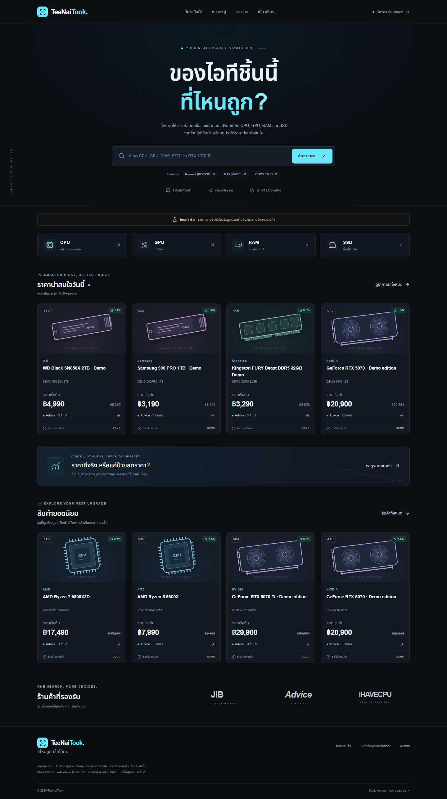
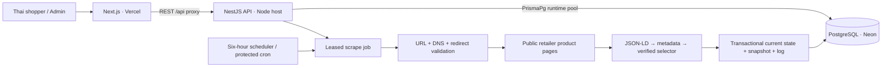

# TeeNaiTook

**ของไอทีชิ้นนี้ ที่ไหนถูก?**

A Thai IT price comparison and price-history application. Search CPUs, GPUs, RAM and SSDs, compare mapped retailer listings, and understand price movement before leaving for the retailer. Brand target: **TeeNaiTook.com**.

Built as a backend developer portfolio: a modular NestJS application, real PostgreSQL history, a defensive scraper, authenticated administration, and a Thai-first Next.js interface.



[Product comparison screenshot](docs/screenshots/product-desktop.png) · [Mobile screenshot](docs/screenshots/home-mobile.png)

## Project overview

TeeNaiTook compares prices; it does not sell products or handle payments. Administrators maintain canonical product specifications and manually map one public product URL per retailer. Supported adapters: **JIB, Advice, iHAVECPU**.

The local demo contains **8 products, 24 sources and 2,184 synthetic snapshots covering 91 days**. All sample prices are visibly labeled. Demo retailer buttons are disabled because no verified product URLs have been supplied. Live scraping is off by default.

For a portfolio link, the web app also includes a **standalone Vercel demo**. It serves the same eight clearly labeled sample products from Next.js Route Handlers, so search, dependent filters, direct-store and Shopee comparison, voucher breakdowns and all chart ranges work without a database or a separately hosted API. Admin writes and scraping remain available only in the full-stack setup.

## Features

- Thai search by name, brand and model/MPN; shareable filters, sorting and bounded pagination.
- Fresh, in-stock comparisons with accurate availability, timestamps and stale-data warnings.
- A separate Shopee comparison for Advice, JIB and iHAVECPU with item price, example shop/platform discounts and a clearly labeled estimated checkout total.
- Recharts history: 7/30/90 days or all tracked history; lowest-price and retailer modes.
- Range low/average/high, tracked low and a documented percentile-based price status.
- Popular products ranked by anonymous page-view totals with per-tab deduplication.
- Admin login with HTTP-only JWT cookie; product creation/editing/archiving, retailer activation and source mapping.
- Single-source tests and full scheduled jobs with durable status, per-source logs and overlap prevention.
- Swagger, health endpoint, strict DTO validation, structured safe logs, fixtures and real database/browser tests.
- Original category illustrations, self-hosted Noto Sans Thai, keyboard navigation, loading/error/empty states and responsive layouts.

## Tech stack

| Layer               | Technology                                                                                                                           |
| ------------------- | ------------------------------------------------------------------------------------------------------------------------------------ |
| Runtime / workspace | Node.js 24 LTS, pnpm 12 workspaces, TypeScript 7                                                                                     |
| Web                 | Next.js 16 App Router, React 19, Tailwind CSS 4, shadcn-style Radix button/dialog primitives, Lucide, Recharts, React Hook Form, Zod |
| API                 | NestJS 12, Express 5, class-validator, Swagger, JWT, bcryptjs, Helmet                                                                |
| Data                | PostgreSQL 17, Prisma 7.10 with `PrismaPg`, SQL migrations, pg_trgm                                                                  |
| Collection          | Node HTTPS, Cheerio, JSON-LD/meta adapters, Nest scheduler                                                                           |
| Quality             | Node test runner, Supertest, Playwright, Oxlint, Prettier, GitHub Actions                                                            |

Direct dependency versions and the pnpm lockfile are committed. Framework choices were checked against the [Next.js installation guide](https://nextjs.org/docs/app/getting-started/installation), [NestJS migration guide](https://docs.nestjs.com/migration-guide), and [Prisma client documentation](https://www.prisma.io/docs/orm/prisma-client/setup-and-configuration/introduction).

## Architecture

```text
apps/
  api/              NestJS modules, Prisma schema/migrations/seed, backend tests
  web/              Next.js pages, UI components, browser tests
docker/             API build/runtime/migration images
docs/               Architecture, API, security, deployment and verification notes
scripts/            Environment setup and development verification helpers
```

The backend is a modular monolith. Controllers handle HTTP concerns; services own queries, normalization, job coordination and business rules. The web app never accesses the database directly. Related small modules are grouped intentionally rather than introducing empty wrappers for every model.

## System architecture



See [architecture and tradeoffs](docs/architecture.md) for query design, worker leases and history semantics.

## Database schema summary

| Model         | Responsibility                                                                                                             |
| ------------- | -------------------------------------------------------------------------------------------------------------------------- |
| User          | Hashed admin credentials and role                                                                                          |
| Product       | Canonical name, unique slug, indexed nullable model number, specifications, archive/demo flags, cached seven-day reference |
| Retailer      | Supported retailer identity, base URL and activation state                                                                 |
| ProductSource | Unique product/retailer mapping, current decimal price, availability and separate checked/success timestamps               |
| PriceSnapshot | Immutable successful, partial or failed observations with provenance                                                       |
| ScrapeJob     | Manual/scheduled trigger, state, counts and heartbeat lease                                                                |
| ScrapeLog     | Safe per-source result, duration, parser and observed price                                                                |

Foreign keys protect history. Indexes support catalogue filtering, partial text search and time-series aggregation. A partial unique index permits only one pending/running scrape job across API instances. Prices use `NUMERIC(12,2)`; public money fields are decimal strings. Conversion to JavaScript numbers is limited to bounded calculations and chart presentation. Timestamps use `timestamptz`, represented as UTC ISO strings; daily buckets and displayed times use **Asia/Bangkok**.

## How price tracking works

1. Admin creates a canonical product and maps a retailer's public product URL.
2. A manual test or six-hour schedule starts a durable job. Source batches are bounded; requests are sequential.
3. The scraper validates the destination, requests public HTML and parses a conservative result.
4. Successful observations update current state and insert history/log records in a transaction.
5. Failed requests record failure snapshots and logs, preserving the last valid price and `lastSuccessAt`.
6. Lists query current sources and cached reference prices. History endpoints aggregate observations in PostgreSQL.

**Cheapest:** a positive current price, known in-stock state, active product/source/retailer and successful check within `SCRAPER_FRESHNESS_HOURS` (12 by default). Ties share the badge. Stale prices may be displayed with a warning but never receive that badge.

**Deals:** current minimum compared with the mean of daily minimum successful in-stock prices over the previous seven Bangkok calendar days. All seven days must have data; cached references expire after 36 hours.

**Price status:** at least 30 daily observations in the preceding 90 days. The percentile is the percentage of historical daily minima strictly below today's price: ≤10% excellent, ≤30% good, ≤75% normal, otherwise relatively high. No forecasts or guarantees.

**History:** range summaries use daily minima, independent of retailer display mode. All-history charts return at most 365 buckets per series, using larger equal-day buckets for long histories. Missing observations produce gaps. Tracked low only describes the period TeeNaiTook actually observed.

## Scraper design

`RetailerScraper` and `ScraperRegistry` isolate adapters. JSON-LD `Product.offers.price` is preferred; OpenGraph product-price metadata is the fallback. Multiple conflicting prices, aggregate variant lows, installments, malformed prices and non-THB offers are not guessed. Unknown stock remains `null` and produces a partial observation.

Retailer-specific selector hooks exist but are **not enabled without live verification**. Tests use tiny original synthetic fixtures, never copied retailer pages. No verified live product mappings were supplied, so this repository makes no claim that all current retailer templates parse successfully. A blocked or changed page produces a clear failure.

Safety includes exact retailer host allowlists, HTTPS, public-address DNS checks, pinned socket resolution, redirect revalidation, a total request timer, response-type/size limits, two transient retries, delays and a single worker. No browser, CAPTCHA bypass, private APIs, proxy rotation or automatic catalogue crawling. See [security notes](docs/security.md).

## Local setup

Prerequisites: Node.js **24.15+ within the 24 LTS line**, pnpm **12.3.4**, and Docker with Compose (or an existing PostgreSQL 17 installation).

```bash
npm install --global pnpm@12.3.4
pnpm install --frozen-lockfile
pnpm setup:env
docker compose up -d --wait db
pnpm db:generate
pnpm db:migrate
pnpm db:seed
pnpm dev
```

`setup:env` creates a root `.env` with random local database, JWT, cron and admin credentials. It preserves an existing file. Use `ADMIN_SEED_EMAIL` and `ADMIN_SEED_PASSWORD` from that file to log in; credentials are never hardcoded or committed.

| Service  | Local URL                         |
| -------- | --------------------------------- |
| Website  | http://localhost:3000             |
| Admin    | http://localhost:3000/admin/login |
| REST API | http://localhost:4000/api         |
| Swagger  | http://localhost:4000/api/docs    |
| Health   | http://localhost:4000/api/health  |

For an existing PostgreSQL installation, create a separate database and set `DATABASE_URL` and `DIRECT_URL` in `.env`, then omit Docker. If port 5432 is occupied, change the Compose host port and both URLs consistently. The web development server loads the root `.env` through its config; the API uses Node's environment-file loader.

### Try the core flows

Search `9800x3d` → open the product → compare the three demo stores → switch chart range and retailer mode.

Log in → Products → add a **new non-demo product** → save → add a retailer URL → test the saved source → view its job. With default settings the result is `SCRAPER_DISABLED`, demonstrating a truthful logged failure without contacting a retailer. Enable live collection only after configuring valid public product URLs. To show real products publicly, restart the API with `DEMO_MODE=false`; sample records are excluded automatically.

## Environment variables

The complete template is [`.env.example`](.env.example). See [environment reference](docs/environment.md) for every default and deployment use.

Key settings: `DATABASE_URL`, `DIRECT_URL`, `FRONTEND_URL`, `API_INTERNAL_URL`, `NEXT_PUBLIC_API_URL`, `JWT_SECRET`, `CRON_SECRET`, `ADMIN_SEED_EMAIL`, `ADMIN_SEED_PASSWORD`, `DEMO_MODE`, and `SCRAPER_ENABLED`.

## Database migration and seed data

```bash
pnpm db:migrate       # applies committed SQL migrations (production-safe deploy command)
pnpm db:seed          # explicit, idempotent: preserves existing admin/products
pnpm db:studio
pnpm db:reset         # destructive development reset; Prisma asks for confirmation
```

For schema changes: `pnpm --filter @teenaitook/api exec prisma migrate dev --name descriptive_name`, then commit the generated SQL. Do not replace migrations with `db push`. Production should use a fresh non-demo database and `DEMO_MODE=false`. That seed inserts only the admin and retailer identities. Existing passwords are deliberately not reset on seed reruns.

## API documentation

Swagger is served at `/api/docs`, OpenAPI JSON at `/api/docs-json`. Public endpoints include catalogue, product details, offers, history, retailers, categories and brands. Admin endpoints require a cookie; mutations also require an allowed `Origin`. The internal cron endpoint uses `x-cron-secret`.

Examples and response contracts: [API reference](docs/api.md).

## Testing

```bash
pnpm lint
pnpm typecheck
pnpm test             # isolated backend unit tests
pnpm test:e2e         # real migrated/seeded development PostgreSQL
pnpm build           # both production builds
pnpm --filter @teenaitook/web exec playwright install chromium
pnpm test:web        # both apps must be running; DEMO_MODE=true, SCRAPER_ENABLED=false
```

If Chrome is already installed, set `PLAYWRIGHT_CHANNEL=chrome` instead of downloading Chromium. In PowerShell: `$env:PLAYWRIGHT_CHANNEL='chrome'`.

Backend integration tests use the real database, replace only the external HTTP transport with a synthetic fixture, and clean up their own records. Browser tests create a uniquely named product and archive it afterward. Never run these tests against production. The [CI workflow](.github/workflows/ci.yml) checks lint, types, tests, builds and the Docker image. See [verification results](docs/verification.md).

## Deployment

Target: Vercel frontend → Docker-compatible long-running NestJS host → Neon PostgreSQL. The API image includes a separate migration target, runs as a non-root user, and has a health check. Use pooled Neon runtime connections and a direct connection for migrations through `prisma.config.ts`.

For a public portfolio demo with no infrastructure bill, import the repository into Vercel, set the project Root Directory to `apps/web`, and deploy. Standalone read-only data activates automatically when no backend URL is configured; no database or secret is required. Set `NEXT_PUBLIC_SITE_URL` to the assigned production domain if you use a custom domain.

Follow the exact steps in [deployment guide](docs/deployment.md). Deployment configuration is included; no cloud resources are provisioned or published automatically.

## What this project demonstrates

REST API architecture, relational modeling, automated data collection, historical prices, background jobs, scraping abstraction, authentication and authorization, SSRF prevention, API documentation, frontend/backend integration and cloud deployment preparation.

Interview discussion points: why current state and snapshots are separate; why product matching is manual; why unknown stock is not considered available; why price comparisons exclude stale offers; why database coordination matters for schedulers; and how failures remain visible without corrupting valid prices.

## Known limitations

- Live retailer template compatibility and authorized product mappings need verification. No real-time price accuracy claim is made.
- Shopee prices and voucher calculations in the standalone demo are synthetic. Live checkout totals require an authorized data source and remain account-, campaign-, payment- and eligibility-dependent.
- Stock and prices omit unobservable coupons, membership offers, shipping and product variants.
- Jobs run inside a long-running Node process. Crashed jobs are marked failed when a later trigger recovers the lease; unfinished sources retry in the next job.
- Public API rate limits are process-local. Use one API replica initially; a shared limiter is needed before horizontal scaling.
- JWT sessions expire without refresh tokens; logout clears the browser cookie. Rotate the signing key to revoke all sessions.
- Demo history ages naturally and becomes stale; seed reruns preserve existing samples. Use a separate disposable demo database for resetting the demonstration.
- Popular products use anonymous page-view totals with per-tab deduplication. These are approximate views, not unique visitors or sales; no visitor identifier is stored.
- Local container execution and external hosting require infrastructure outside the source project; see the verification report for what was actually run.

## Future improvements

Automatic matching, opt-in email/LINE price alerts, public accounts and wishlists, affiliate links, Redis/shared rate limits, BullMQ, official retailer feeds, more categories and retailers, a browser extension and cautiously evaluated price prediction. These are future directions, not hidden MVP dependencies.

## Legal / data disclaimer

ราคาและสถานะสินค้าอาจมีการเปลี่ยนแปลง กรุณาตรวจสอบราคาล่าสุดกับร้านค้าก่อนสั่งซื้อ ข้อมูลราคาบน TeeNaiTook ใช้เพื่อเปรียบเทียบราคาเท่านั้น เว็บไซต์ไม่ได้เป็นผู้จำหน่ายสินค้า

All demo prices are synthetic. Retailer names identify comparison sources and do not imply endorsement. Product descriptions are independently maintained; retailer images and logos are not copied. Review retailer terms and public access policies before enabling collection.
