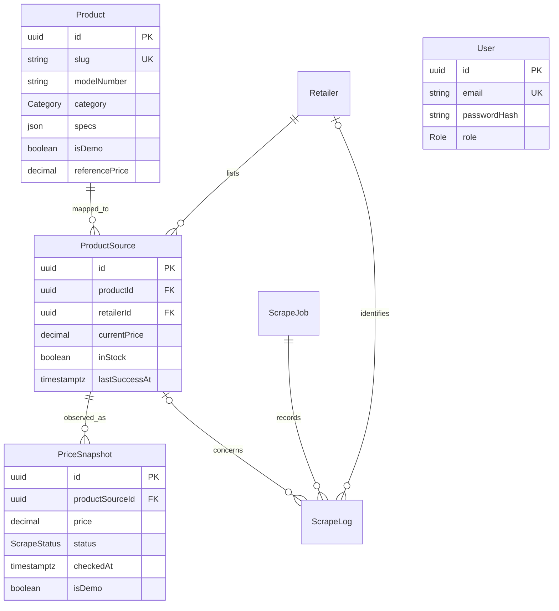
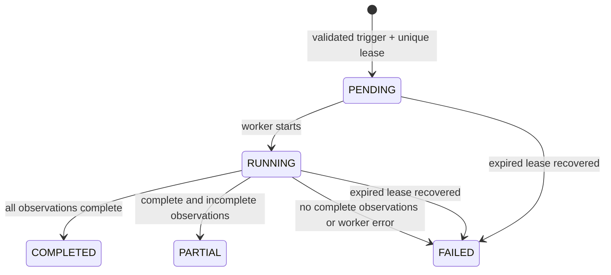

# Architecture and data decisions

## Modules

`PrismaModule` owns the database pool. `ProductsModule` groups public products, catalogue identities and price-history services. `AuthModule` owns authentication/authorization. `AdminModule` owns validated product/source management. `ScraperModule` owns adapters, safe HTTP, job orchestration and the protected cron controller. Health is a small controller.

## Current state versus history

`ProductSource` is the current state. Listing queries use indexed products, an active-source lateral aggregate, a paginated ID query, and a small relation fetch. They never scan `PriceSnapshot`. A count query supplies accurate pagination even on an empty page. Name/model/brand search uses escaped parameterized `ILIKE` and trigram indexes.

The list uses source freshness to exclude stale minima and cached product reference fields for price-drop sorting. Reference computation runs after collection and during the demo seed. The 36-hour cache expiry prevents old references from silently being represented as today's seven-day baseline. No Redis service is required for the MVP.

History queries aggregate successful, positive, known-in-stock observations in PostgreSQL, grouped by Bangkok calendar date. Multiple observations on a day collapse to a minimum. Selected-range low/average/high are computed from those daily minima. The tracked low is queried across all collected observations, while price status uses the preceding 90 days excluding today. Chart data is capped at 365 equal-day buckets per series; statistics use original daily values even when the chart is downsampled.

Raw price is a decimal string until presentation. Database money uses `NUMERIC(12,2)`, preserving satang. Numeric comparisons for display stay below the schema's 10-billion-baht bound, safely below JavaScript's exact integer-cent range. Percentage results are rounded to one decimal place.

## Scrape state machine

A database partial unique index admits only one pending/running job. A later trigger recovers leases older than five minutes. Each source renews the heartbeat before bounded DNS/HTTP work. Requests are sequential, including manual single-source tests. Retries are bounded to two with one/two-second exponential backoff and never retry access-control responses.

Snapshots, current-state changes and success logs commit together. The transaction rechecks the job state and source URL so a changed mapping cannot inherit a just-fetched old listing price. Failed collection records an error snapshot/log and only updates the latest attempted timestamp/error on the matching source. It never updates the last successful timestamp or discards the valid price. Unknown stock produces a partial observation and cannot claim availability.

Reference-refresh errors are separate from scrape errors: a committed successful observation is not counted a second time as a failed scrape. Logs contain safe codes, normalized price/name/parser and durations, never raw HTML or request credentials.

The scheduler and worker live in one always-running Nest process. This is not a distributed durable queue. A crash may leave unfinished sources until the next job; the lease lets the next trigger recover. Source records are loaded in batches of 50. A future BullMQ queue would be justified by higher throughput or stronger delivery guarantees, not by the portfolio alone.

## Demo and live provenance

Product, source and snapshot records have explicit demo flags. Public queries select only the configured dataset. The live worker only accepts non-demo mappings; creating a live URL on a demo product is rejected. Production rejects `DEMO_MODE=true` at startup. Deployment should still use a separate database to avoid confusing operators and metrics.

Demo source URLs point to base retailer domains solely as non-actionable placeholders. The public serializer emits `url: null`; buttons remain disabled. Real source links always use their validated product-page URLs, and external links use `noopener noreferrer nofollow`.

## Frontend boundaries

The homepage's popular section sorts by an atomic database page-view counter, then product name. A client component records one view per product per browser tab using session storage. It stores no visitor identifier. This lightweight counter is approximate, can include automated traffic, and does not represent unique visitors or sales.

Public pages fetch Nest REST data on the server, with client components for suggestions, chart controls and admin interactions. No duplicated mock catalogue or browser-local data store exists. Admin pages wait for `/auth/me`; the backend guard remains the authority on every protected request. Same-origin `/api` forwarding avoids cross-site cookie dependencies.

The optional React `set-state-in-effect` lint suggestion is disabled because small fetch hooks explicitly reset loading/error state when synchronizing a new remote query. The accessibility `prefer-tag-over-role` suggestion is disabled for custom chart/live-region widgets. Accessibility semantics, focus states and keyboard interactions remain checked. Explicit `any` is prohibited in application code.
